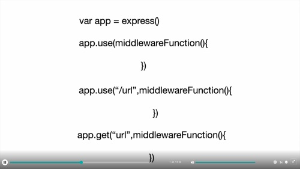

# Project: FirstProject Node

## Project References

### Task: Add a package.json file

1. Run ```npm init```

```Javascript
Press ^C at any time to quit.
package name: (firstproject) firstpackage
version: (1.0.0)
description: My first node package
entry point: (index.js)
test command:
git repository:
keywords:
```

1. Run ```npm install express --save```
2. Run ```npm i mongodb --save```

### Task: Create file .gitignore

### Note there is a package 'os' to interigate you computer os

### Arrow functions

```javascript
fs = require(`fs`);
fs.writeFile('sample.txt', 'this is just some text');

function handlerFileCreation(err) {
    if(err) throw err;
    console.log('created file');
}

// method #2

fs = require(`fs`);
fs.writeFile('sample.txt', 'some text', handlerFileCreation(err) );

// method #3
fs.writeFile('sample.txt', function(err) {
    if(err) throw err;
    console.log('created file');
});
console.log('END');

// method #4
fs.writeFile('sample.txt', 'over write with this text', (err) => {
    if(err) throw err;
    console.log('created file');
});
console.log('END');

```

Add to the file: ```fs.appendFile();```

Rename the file: ```fs.rename('sample.txt' newSample.txt' )```

### Read a file (asyc)

```javascript
fs.readFile('myfile.txt', (err, 'utf8', data) => {
    ir (err) throw err;
    console.log(data);
});

```

### Notes: Express commands


### Delete a file

```javascript
// this will delete the file
fs.unlink('myFile.txt', (err) => {
    if(err) throw err;
    console.log('file deleted!');
});
 
```
